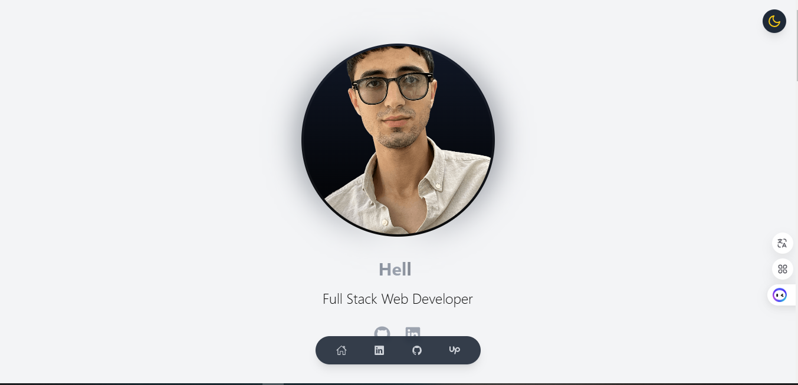

# Personal Portfolio - Lahmamsi Mohammed

[](https://lh-med97.github.io/my-portfolio/)
[](https://github.com/lh-Med97/my-portfolio/blob/main/LICENSE)

A modern, responsive portfolio website built with React and Vite, showcasing my skills, projects, and professional journey.



## 🚀 Features

- **Responsive Design**: Mobile-first approach ensuring perfect display across all devices
- **Dark/Light Mode**: Theme toggle with localStorage persistence
- **Smooth Animations**: Powered by Framer Motion for engaging user experience
- **Modern UI**: Built with Tailwind CSS for a clean, modern look
- **Interactive Elements**: Dynamic components with smooth transitions
- **Performance Optimized**: Fast loading and optimal rendering

## 🛠️ Tech Stack

- **Frontend**: React.js with Vite
- **Styling**: Tailwind CSS
- **Animations**: Framer Motion
- **Icons**: React Icons
- **State Management**: React Context API
- **Deployment**: GitHub Pages

## 🎯 Key Components

- Dynamic Header with TypeAnimation
- Interactive Project Showcase
- Skills Section with Categories
- Educational Timeline
- Professional Experience Display
- Contact Information

## 🚀 Getting Started

1. **Clone the repository**
   ```bash
   git clone https://github.com/lh-Med97/my-portfolio.git
   cd my-portfolio
   ```

2. **Install dependencies**
   ```bash
   npm install
   ```

3. **Run development server**
   ```bash
   npm run dev
   ```

4. **Build for production**
   ```bash
   npm run build
   ```

## 🔧 Configuration

- **Theme**: Edit theme configuration in `src/context/ThemeContext.jsx`
- **Content**: Update personal information in respective components
- **Styling**: Modify Tailwind configuration in `tailwind.config.js`

## 📱 Responsive Design

- Mobile-first approach
- Breakpoints for all devices
- Flexible grid layouts
- Optimized images and assets

## ✨ Future Enhancements

- [ ] Contact form integration
- [ ] Blog section
- [ ] Project filtering
- [ ] Performance optimization
- [ ] Additional animations
- [ ] Accessibility improvements

## 📄 License

This project is licensed under the MIT License - see the [LICENSE](LICENSE) file for details.

## 🤝 Contact

- LinkedIn: [Lahmamsi Mohammed](https://www.linkedin.com/in/mohammed-lahmamsi-7a9b1a1b9/)
- GitHub: [@lh-Med97](https://github.com/lh-Med97)
- Portfolio: [lh-med97.github.io/my-portfolio](https://lh-med97.github.io/my-portfolio/)

---

⭐️ If you like this portfolio, give it a star on GitHub!
